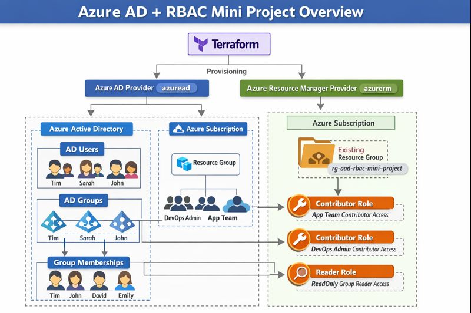

# Azure AD + RBAC Mini Project 

> **Project:** `azure-ad-rbac-mini-project`

> **Purpose:** Create sample Azure AD users, groups, group memberships, and apply RBAC at a Resource Group scope using Terraform.

> **Status:** Tested & working (assumes Service Principal has required Azure AD + Azure RBAC permissions which is must for this project).


---

## Table of contents

1. [What this project creates](#what-this-project-creates)
2. [Repository structure](#repository-structure)
3. [Prerequisites](#prerequisites)
4. [Quick start — commands](#quick-start---commands)
5. [Environment variables (Service Principal)](#environment-variables-service-principal)
6. [How it works (flow)](#how-it-works-flow)
7. [Variables & sample `terraform.tfvars`](#variables--sample-terraformtfvars)
8. [Outputs you will get](#outputs-you-will-get)
9. [Cleanup / destroy](#cleanup--destroy)
10. [Troubleshooting & tips](#troubleshooting--tips)
11. [Security notes](#security-notes)
12. [References](#references)

---

## What this project creates

* Azure AD **Users** (sample users with first/last name + password; forced to change password on first login)
* Azure AD **Groups** (devops_admin, app_team, readonly)
* Azure AD **Group memberships** (map users into groups)
* **RBAC role assignments** at an existing Resource Group scope (Contributor / Reader roles assigned to groups)
* **No new Resource Group is created** by default if you point to an existing RG (this repo supports both modes; current config uses an existing RG name).

---

## Repository structure

```
.
├─ providers.tf        # providers + backend config (azurerm + azuread)
├─ main.tf             # data.azurerm_resource_group (existing RG) or create RG
├─ aad.tf              # azuread_user, azuread_group, azuread_group_member resources
├─ rbac.tf             # azurerm_role_assignment resources (RBAC at RG scope)
├─ variables.tf        # variable definitions
├─ outputs.tf          # outputs for verification
├─ terraform.tfvars    # project values (sample provided)
├─ .gitignore
└─ README.md
```

---

## Prerequisites

* Terraform >= 1.5.0
* An Azure Subscription where you have ability to assign roles or a Service Principal (SP) with needed permissions (see **Troubleshooting & tips**)
* `az` CLI (helpful) — not strictly required if you authenticate via env vars
* A storage account + container configured if you use the `azurerm` backend (this repo uses remote backend example)

---

## Quick start — commands

1. Export SP environment variables (example):

```bash
export ARM_CLIENT_ID="your-sp-client-id"
export ARM_CLIENT_SECRET="your-sp-client-secret"
export ARM_TENANT_ID="your-tenant-id"
export ARM_SUBSCRIPTION_ID="your-subscription-id"
```

2. Initialize Terraform backend & providers:

```bash
terraform init -reconfigure
```

3. Review plan:

```bash
terraform plan -out plan.tfplan
```

4. Apply:

```bash
terraform apply "plan.tfplan"
# or
terraform apply --auto-approve
```

5. Verify outputs:

```bash
terraform output
```

---

## Environment variables (Service Principal)

Terraform in this project uses:

* `azurerm` provider (access Azure resources like role assignments / RG)
* `azuread` provider (create users/groups)

Set these env vars for the SP you will use:

```bash
export ARM_CLIENT_ID="..."
export ARM_CLIENT_SECRET="..."
export ARM_TENANT_ID="..."
export ARM_SUBSCRIPTION_ID="..."
```

**Important:** the SP must have both:

* Azure AD role(s) to create users/groups (e.g., **User Administrator** or equivalent in AAD)
* Azure RBAC permissions to assign roles at the subscription/RG level (see Troubleshooting)

---

## How it works (flow)

1. Terraform reads configuration and the existing Resource Group (data.azurerm_resource_group.this).
2. `azuread_user` resources are created (names & UPNs built from `first_name` + `last_name` + tenant domain).
3. `azuread_group` resources are created.
4. `azuread_group_member` resources add users to groups.
5. `azurerm_role_assignment` resources grant RBAC (Contributor / Reader) on the specified Resource Group to the Azure AD groups.
6. Outputs list created users, groups and RBAC assignments for quick verification.

---

## Variables & sample `terraform.tfvars`

`variables.tf` defines:

* `location`, `environment`, `resource_group_name`, `tenant_domain`
* `users` (map of `{ first_name, last_name, password }`)
* `groups` (map of `{ display_name, description }`)
* `group_membership` (map of `{ users = [...] }`)

**Sample `terraform.tfvars`:**

```hcl
location            = "centralindia"
environment         = "dev"
resource_group_name = "rg-aad-rbac-mini-project"
tenant_domain       = "rhsrohitsharmagmail.onmicrosoft.com"

users = {
  tim = { first_name = "Tim",   last_name = "Paine",   password = "DevOps@12345!" }
  john = { first_name = "John", last_name = "Miller",  password = "Backend@12345!" }
  sarah = { first_name = "Sarah", last_name = "Johnson", password = "Frontend@12345!" }
  david = { first_name = "David", last_name = "Brown", password = "QA@12345!" }
  emily = { first_name = "Emily", last_name = "Clark", password = "Readonly@12345!" }
}

groups = {
  devops_admin = { display_name = "grp-devops-admin", description = "DevOps administrators with contributor access" }
  app_team     = { display_name = "grp-app-contributor", description = "Application team with contributor access" }
  readonly     = { display_name = "grp-readonly", description = "Read-only access group" }
}

group_membership = {
  devops_admin = { users = ["tim"] }
  app_team     = { users = ["john", "sarah", "david"] }
  readonly     = { users = ["emily"] }
}
```

> Tip: keep this file out of version control if it contains secrets (passwords). Use secure variable storage for production.

---

## Outputs you will get

* `resource_group_name` — name of RG used as RBAC scope
* `azure_ad_users` — list of UPNs created
* `azure_ad_groups` — list of group display names created
* `rbac_role_assignments` — mapping of roles applied at RG level

---

## Cleanup / destroy

To remove everything Terraform created:

```bash
terraform destroy --auto-approve
```

> NOTE: If you used an **existing** Resource Group (not created by Terraform), the RG itself will not be destroyed — only role assignments and AD objects created in this run will be removed. Check state before destroying.

---

## Troubleshooting & tips

### 1. `403` errors when creating AAD users/groups

* Ensure the SP has **Azure AD** privileges to create users/groups (e.g., **User Administrator**). This is set in **Azure AD → Roles and administrators → User Administrator**.

### 2. `403` errors when creating RBAC role assignments

* Creating role assignments requires Azure RBAC permission. Give the Service Principal one of:

  * **User Access Administrator** at Subscription or RG scope (recommended for RBAC management), or
  * **Owner** at Subscription or RG scope.
* Portal path: **Subscriptions → [your subscription] → Access control (IAM) → Add role assignment** → choose **User Access Administrator** → assign to your SP.

### 3. Backend access errors (terraform init)

* If using an `azurerm` remote backend, the SP must be able to read the storage account and list keys (or have appropriate role):

  * Assign `Storage Account Contributor` or a role that allows `Microsoft.Storage/storageAccounts/listKeys/action` and read access on the storage account/resource group.
* Alternatively create a dedicated backend SP with storage permissions only.

### 4. Propagation delays

* After assigning roles in Azure (AD roles or RBAC), wait **2–5 minutes** for propagation before rerunning `terraform apply`.

### 5. Sensitive values & `for_each`

* If you mark the `users` map or passwords as `sensitive`, Terraform will error if you use that value directly in `for_each`. In this project the `users` map should be non-sensitive so it can be iterated. Keep secrets safe in `terraform.tfvars` or use a secret manager in production.

---

## Security notes

* Passwords in `terraform.tfvars` are plaintext here for learning only. In real environments use Azure Key Vault or Terraform Cloud/Enterprise variable secrets.
* Avoid giving SP `Owner` at subscription if not required; prefer least privilege (e.g., `User Access Administrator` only when doing role assignments).
* Remove the SP's elevated permissions after provisioning if not needed.

---

## Example `az` CLI role assignment (if you prefer CLI)

```bash
# Assign User Access Administrator at subscription scope
az role assignment create \
  --assignee <SP_CLIENT_ID_OR_OBJECT_ID> \
  --role "User Access Administrator" \
  --scope "/subscriptions/<SUBSCRIPTION_ID>"
```

Wait a few minutes, then re-run `terraform apply`.

---


