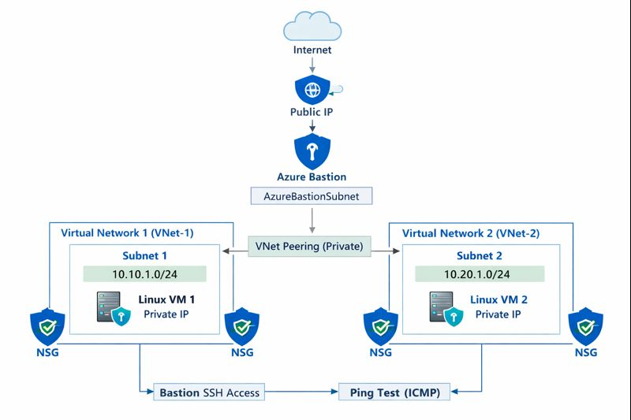

# Azure VNet Peering with Private VMs using Terraform

## Project Purpose
This mini project demonstrates how to securely connect virtual machines deployed in **different Azure Virtual Networks** using **VNet Peering**, while keeping all machines private and accessible only through **Azure Bastion**.

The focus of this project is **networking flow and security design**, not application deployment.

---

## High-Level Architecture Flow

1. A Resource Group is created to host all resources.
2. Two Virtual Networks (VNet-1 and VNet-2) are provisioned with non-overlapping address spaces.
3. One subnet is created inside each VNet.
4. Bi-directional VNet peering is established between the two VNets.
5. One Linux Virtual Machine is deployed in each subnet.
6. A Network Security Group is applied at the subnet level to control traffic.
7. Azure Bastion is deployed in a dedicated subnet to securely access the private VMs.
8. Private IP communication is used to validate connectivity between VMs.

---

## Networking Design

### Virtual Networks
- VNet-1: `10.10.0.0/16`
- VNet-2: `10.20.0.0/16`

Both VNets are deployed in the same Azure region and use non-overlapping CIDR ranges.

### Subnets
- Each VNet contains one workload subnet.
- An additional subnet named `AzureBastionSubnet` is created for Bastion (mandatory requirement).

### VNet Peering
- Peering is configured in **both directions**.
- Allows private IP communication between VNets.
- No gateway transit or forwarded traffic is used.

---

## Virtual Machines

- One Linux VM is deployed per subnet.
- VMs use **private IP addresses only**.
- No public IPs are assigned.
- Ubuntu 22.04 LTS is used for stability.
- SSH key-based authentication is enabled.

---

## Security Design

### Network Security Group (NSG)
- Applied at the subnet level.
- Allows:
  - SSH (port 22) for Bastion access
  - ICMP for connectivity testing
- All other inbound traffic is implicitly denied.

### Azure Bastion
- Provides secure browser-based SSH access.
- Eliminates the need for public IPs or jumpbox VMs.
- Uses a Standard public IP attached only to Bastion.

---

## Terraform Implementation Approach

- Infrastructure is defined using Terraform (IaC).
- `for_each` is used to create VNets, subnets, NICs, and VMs in a scalable manner.
- Variables and tfvars are used to keep configurations flexible.
- A remote backend is configured using Azure Storage for state management.
- Outputs are defined for validation and testing.

---

## Connectivity Validation Flow

1. Connect to a VM using Azure Bastion from the Azure Portal.
2. Retrieve the private IP of the second VM.
3. Use ICMP (ping) to verify connectivity across VNets.
4. Successful response confirms VNet peering and routing are working correctly.

---

## Key Learnings

- Azure VNet peering behavior and limitations
- Importance of bi-directional peering
- Secure VM access without public exposure
- Bastion architecture and requirements
- Terraform state management and locking
- Scalable infrastructure design using `for_each`

---

## Real-World Relevance

This architecture reflects common enterprise patterns such as:
- Hub-and-spoke networking
- Environment isolation (dev/test/prod)
- Secure administrative access
- Private workload communication

---

## Conclusion

This project provides a strong foundation in Azure networking and Terraform-based infrastructure design.  
The same concepts can be extended to larger architectures involving Application Gateways, Private Endpoints, or AKS clusters.

---

**Author:** Rohit Sharma  
**Role:** DevOps / Cloud Engineer
